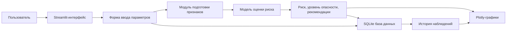

# SelFlow-Monitor

> [!summary]
> Цель проекта - разработать простой, понятный и визуально красивый прототип системы прогнозирования риска селевых потоков для четырех рек КБР: **Баксан**, **Малка**, **Черек**, **Чегем**.
>
> Пользователь вводит параметры окружающей среды, система рассчитывает вероятность селевого события, сохраняет данные в базу и строит интерактивные графики.

## 1. Концепция проекта

### 1.1. Что должно получиться

Нужно сделать веб-приложение, которое работает как демонстрационный аналитический модуль системы мониторинга.

Пользователь открывает интерфейс, выбирает реку, вводит текущие параметры и получает:

- числовую вероятность селевого события;
- уровень опасности;
- цветовую индикацию риска;
- временные ряды параметров;
- временной ряд риска;
- 3D-поверхность риска;
- сравнение риска по четырем рекам;
- график влияния факторов на прогноз.

### 1.2. Что важно для диплома

Проект должен быть не слишком сложным технически, но выглядеть убедительно:

- есть база данных;
- есть архитектура приложения;
- есть модель прогнозирования;
- есть интерактивный интерфейс;
- есть несколько видов графиков;
- есть сохранение истории измерений;
- есть возможность показать работу системы на тестовых данных.

### 1.3. Что не делаем в первой версии

В первой версии не нужно поднимать тяжелую промышленную инфраструктуру:

- Apache Kafka;
- Apache Flink;
- Hadoop;
- Kubernetes;
- реальную сеть датчиков;
- сложную LSTM/GRU-модель;
- полноценную авторизацию пользователей.

Эти технологии можно описать в дипломе как перспективную промышленную архитектуру, но в программе реализовать простой рабочий прототип.

## 2. Выбранный стек

> [!tip]
> Для диплома лучше выбрать стек, который быстро дает красивый результат и легко объясняется на защите.

| Слой | Технология | Зачем используется |
|---|---|---|
| Интерфейс | Streamlit | Быстрое создание веб-дашборда на Python |
| Графики | Plotly | Интерактивные 2D и 3D графики |
| Обработка данных | Pandas, NumPy | Таблицы, расчеты, генерация временных рядов |
| Модель прогноза | scikit-learn | Простая ML-модель риска |
| База данных | SQLite | Локальная база без сложной настройки |
| Работа с БД | SQLAlchemy | Удобный доступ к SQLite, возможность перейти на PostgreSQL |
| Конфигурация | python-dotenv | Хранение настроек приложения |
| Тестовые данные | CSV + генератор данных | Быстрое наполнение базы |

## 3. Архитектура приложения

### 3.1. Упрощенная архитектура прототипа



### 3.2. Логические модули

| Модуль | Файл | Назначение |
|---|---|---|
| Главная точка входа | `app.py` | Запуск Streamlit-приложения |
| Конфигурация | `config.py` | Константы, пороги риска, список рек |
| База данных | `database.py` | Подключение к SQLite, создание таблиц |
| Модели БД | `models.py` | Описание таблиц через SQLAlchemy |
| Расчет риска | `risk_engine.py` | Формула риска и правила классификации |
| ML-модель | `ml_model.py` | Обучение и применение модели scikit-learn |
| Генерация данных | `data_generator.py` | Создание тестовых временных рядов |
| Графики | `visualization.py` | Plotly-графики |
| Справочники | `rivers.py` | Данные по Баксану, Малке, Череку, Чегему |
| Утилиты | `utils.py` | Общие функции |

## 4. Структура проекта

```text
SelFlow-Monitor/
  app.py
  config.py
  database.py
  models.py
  risk_engine.py
  ml_model.py
  visualization.py
  data_generator.py
  rivers.py
  utils.py
  requirements.txt
  README.md
  PROJECT_PLAN.md
  data/
    selflow.db
    sample_measurements.csv
    historical_events.csv
  models/
    risk_model.joblib
  assets/
    screenshots/
```

## 5. Реки и базовые коэффициенты

Для прототипа каждая река получает коэффициент базовой селевой опасности. Это нужно, чтобы одинаковые параметры давали немного разный риск для разных бассейнов.

| Река | Базовый коэффициент | Обоснование для диплома |
|---|---:|---|
| Баксан | 1.15 | Высокая селевая активность, развитая горная инфраструктура |
| Малка | 1.00 | Крупный бассейн, значимый вклад снеготаяния |
| Черек | 1.05 | Крутые склоны, выраженная горная морфология |
| Чегем | 1.10 | Исторически опасный бассейн, ливневые и смешанные триггеры |

## 6. Входные параметры

### 6.1. Основные параметры формы

| Параметр | Переменная | Единица | Диапазон в интерфейсе |
|---|---|---:|---:|
| Интенсивность осадков | `precipitation` | мм/ч | 0-100 |
| Температура воздуха | `temperature` | °C | -20...40 |
| Влажность почвы/воздуха | `humidity` | % | 0-100 |
| Расход воды | `water_flow` | м3/с | 0-300 |
| Запас воды в снеге | `snow_water` | мм | 0-1000 |
| Сейсмическая активность | `seismic_activity` | усл. ед. | 0-10 |
| Река | `river` | категория | Баксан, Малка, Черек, Чегем |
| Дата и время | `timestamp` | datetime | выбирает пользователь |

### 6.2. Дополнительные расчетные признаки

Система может автоматически считать производные признаки:

- накопленные осадки за 3 часа;
- накопленные осадки за 6 часов;
- скорость изменения расхода;
- температурный фактор снеготаяния;
- индекс водонасыщения;
- интегральный индекс сейсмической нестабильности.

## 7. Формула риска для первой версии

### 7.1. Зачем нужна формула

Формула нужна, чтобы приложение стабильно работало даже без обученной ML-модели.

Она понятна для защиты: каждый фактор нормируется от 0 до 1, умножается на вес, затем итоговый риск переводится в проценты.

### 7.2. Пример весов

| Фактор | Вес |
|---|---:|
| Осадки | 0.25 |
| Расход воды | 0.22 |
| Влажность | 0.15 |
| Снег / снеготаяние | 0.15 |
| Температура | 0.08 |
| Сейсмика | 0.15 |

### 7.3. Расчет

```text
risk_raw =
  0.25 * precipitation_score +
  0.22 * water_flow_score +
  0.15 * humidity_score +
  0.15 * snow_score +
  0.08 * temperature_score +
  0.15 * seismic_score

risk_percent = risk_raw * river_coefficient * 100
```

Итоговое значение ограничивается диапазоном `0-100`.

## 8. Уровни опасности

| Риск | Уровень | Цвет | Текст для интерфейса |
|---:|---|---|---|
| 0-30% | Низкий | Зеленый | Ситуация стабильная |
| 30-55% | Повышенный | Желтый | Требуется наблюдение |
| 55-75% | Высокий | Оранжевый | Вероятны опасные процессы |
| 75-100% | Критический | Красный | Необходимо предупреждение |

## 9. ML-модель

### 9.1. Простая модель для диплома

Для интеллектуального блока достаточно использовать `RandomForestClassifier` или `HistGradientBoostingClassifier`.

Модель получает входные признаки:

- река;
- осадки;
- температура;
- влажность;
- расход;
- снег;
- сейсмика;
- накопленные осадки;
- скорость изменения расхода;
- сезонный признак.

На выходе модель выдает:

- `0` - селевое событие маловероятно;
- `1` - риск селевого события повышен.

Дополнительно используется вероятность класса `1`, которая выводится как риск.

### 9.2. Откуда взять данные

Так как реальных данных может не быть, для прототипа используем смешанный подход:

1. Исторические события из диплома заносим в таблицу `mudflow_events`.
2. Генерируем синтетические временные ряды вокруг этих событий.
3. Добавляем нормальные периоды без селей.
4. Обучаем модель на искусственно расширенном датасете.

Это допустимо для демонстрационного прототипа, если честно описать в дипломе: модель апробирована на подготовленном тестовом наборе данных.

## 10. База данных

### 10.1. Таблица `rivers`

| Поле | Тип | Описание |
|---|---|---|
| `id` | integer | Первичный ключ |
| `name` | string | Название реки |
| `basin_area` | float | Площадь бассейна |
| `slope_index` | float | Индекс уклона |
| `risk_coefficient` | float | Базовый коэффициент риска |
| `description` | text | Краткое описание |

### 10.2. Таблица `measurements`

| Поле | Тип | Описание |
|---|---|---|
| `id` | integer | Первичный ключ |
| `river_id` | integer | Связь с таблицей рек |
| `timestamp` | datetime | Время наблюдения |
| `precipitation` | float | Осадки |
| `temperature` | float | Температура |
| `humidity` | float | Влажность |
| `water_flow` | float | Расход воды |
| `snow_water` | float | Запас воды в снеге |
| `seismic_activity` | float | Сейсмический показатель |

### 10.3. Таблица `predictions`

| Поле | Тип | Описание |
|---|---|---|
| `id` | integer | Первичный ключ |
| `measurement_id` | integer | Измерение, по которому сделан прогноз |
| `risk_percent` | float | Риск в процентах |
| `risk_level` | string | Уровень опасности |
| `model_type` | string | Formula или ML |
| `created_at` | datetime | Время расчета |

### 10.4. Таблица `mudflow_events`

| Поле | Тип | Описание |
|---|---|---|
| `id` | integer | Первичный ключ |
| `river_id` | integer | Река |
| `event_date` | date | Дата события |
| `duration_min` | integer | Продолжительность |
| `volume_thousand_m3` | float | Объем выноса |
| `power_level` | string | Мощность |
| `trigger_factor` | string | Триггерный фактор |

## 11. Интерфейс приложения

### 11.1. Страница "Панель мониторинга"

Главная страница приложения.

На ней должны быть:

- выбор реки;
- текущий риск;
- карточка уровня опасности;
- последние значения параметров;
- график риска за период;
- сравнение четырех рек.

### 11.2. Страница "Ввод данных"

Форма ручного ввода параметров:

- река;
- дата и время;
- осадки;
- температура;
- влажность;
- расход;
- снег;
- сейсмика;
- кнопка "Рассчитать риск";
- кнопка "Сохранить в базу".

После расчета показывается:

- риск в процентах;
- уровень опасности;
- краткая рекомендация.

### 11.3. Страница "Аналитика"

Здесь находятся основные графики:

- временные ряды параметров;
- временной ряд риска;
- 3D-поверхность риска;
- диаграмма факторов;
- тепловая карта риска по рекам и датам.

### 11.4. Страница "История событий"

Таблица исторических событий:

- дата;
- река;
- мощность;
- объем;
- триггерный фактор;
- длительность.

Можно добавить фильтр по реке и году.

### 11.5. Страница "О системе"

Краткое описание:

- назначение системы;
- используемые параметры;
- архитектура;
- ограничения прототипа;
- отличие прототипа от промышленной версии.

## 12. Графики

### 12.1. Временные ряды параметров

Линейный график по выбранной реке:

- осадки;
- расход;
- влажность;
- температура;
- сейсмика;
- риск.

### 12.2. Временной ряд риска

Отдельный график риска во времени:

- ось X - дата и время;
- ось Y - риск в процентах;
- цветовая зона показывает уровень опасности.

### 12.3. 3D-поверхность риска

Главный эффектный график для защиты.

Оси:

- X - осадки;
- Y - расход воды;
- Z - риск.

Для выбранной реки строится поверхность, показывающая, как риск растет при увеличении осадков и расхода.

### 12.4. Сравнение четырех рек

Столбчатая диаграмма:

- Баксан;
- Малка;
- Черек;
- Чегем.

Для каждой реки показывается текущий риск.

### 12.5. Вклад факторов

Горизонтальная диаграмма:

- осадки;
- расход;
- влажность;
- снег;
- температура;
- сейсмика.

В первой версии вклад можно брать из весов формулы. После обучения ML-модели можно показывать `feature_importances_`.

### 12.6. Тепловая карта риска

Дополнительный график:

- строки - реки;
- столбцы - даты;
- цвет - средний риск за день.

## 13. Дорожная карта реализации

### Этап 1. Подготовка проекта

- [ ] Создать структуру файлов.
- [ ] Создать `requirements.txt`.
- [ ] Настроить запуск `streamlit run app.py`.
- [ ] Добавить базовый `README.md`.
- [ ] Создать папки `data/`, `models/`, `assets/screenshots/`.

Результат этапа: приложение запускается и показывает пустой каркас интерфейса.

### Этап 2. Справочник рек

- [ ] Описать 4 реки в `rivers.py`.
- [ ] Добавить коэффициенты риска.
- [ ] Добавить краткое описание каждой реки.
- [ ] Вывести выбор реки в интерфейсе.

Результат этапа: пользователь может выбрать одну из четырех рек.

### Этап 3. База данных

- [ ] Создать SQLAlchemy-модели.
- [ ] Создать таблицы `rivers`, `measurements`, `predictions`, `mudflow_events`.
- [ ] Написать функцию инициализации базы.
- [ ] Добавить заполнение справочника рек.
- [ ] Добавить исторические события из диплома.

Результат этапа: SQLite-база создается автоматически при первом запуске.

### Этап 4. Форма ввода параметров

- [ ] Сделать страницу "Ввод данных".
- [ ] Добавить поля для осадков, температуры, влажности, расхода, снега и сейсмики.
- [ ] Добавить валидацию диапазонов.
- [ ] Добавить кнопку расчета риска.
- [ ] Добавить кнопку сохранения результата.

Результат этапа: пользователь вводит параметры и получает расчет.

### Этап 5. Расчет риска

- [ ] Реализовать нормализацию факторов.
- [ ] Реализовать формулу риска.
- [ ] Учесть коэффициент выбранной реки.
- [ ] Реализовать классификацию уровня опасности.
- [ ] Вернуть рекомендацию для оператора.

Результат этапа: система выдает риск и уровень опасности.

### Этап 6. История наблюдений

- [ ] Сохранять введенные измерения в `measurements`.
- [ ] Сохранять прогнозы в `predictions`.
- [ ] Показывать таблицу последних наблюдений.
- [ ] Добавить фильтр по реке.
- [ ] Добавить фильтр по дате.

Результат этапа: приложение хранит историю расчетов.

### Этап 7. Генератор тестовых данных

- [ ] Написать генератор временных рядов.
- [ ] Сгенерировать данные за 30-90 дней.
- [ ] Сделать разные профили для четырех рек.
- [ ] Добавить периоды нормального состояния.
- [ ] Добавить периоды повышенного риска.

Результат этапа: в приложении есть данные для красивых графиков.

### Этап 8. Визуализация

- [ ] Сделать график временных рядов параметров.
- [ ] Сделать график риска во времени.
- [ ] Сделать 3D-поверхность риска.
- [ ] Сделать сравнение риска по четырем рекам.
- [ ] Сделать график вклада факторов.
- [ ] Сделать тепловую карту риска.

Результат этапа: приложение выглядит как полноценная аналитическая система.

### Этап 9. ML-модель

- [ ] Подготовить обучающую выборку.
- [ ] Закодировать категориальный признак реки.
- [ ] Обучить `RandomForestClassifier`.
- [ ] Сохранить модель в `models/risk_model.joblib`.
- [ ] Добавить переключатель "Формула / ML-модель".
- [ ] Вывести вероятность риска по ML-модели.

Результат этапа: в системе есть интеллектуальный модуль прогнозирования.

### Этап 10. Финальное оформление

- [ ] Настроить широкую компоновку Streamlit.
- [ ] Добавить цветовые карточки риска.
- [ ] Добавить аккуратное боковое меню.
- [ ] Добавить подписи и единицы измерения.
- [ ] Добавить скриншоты в `assets/screenshots/`.
- [ ] Обновить `README.md`.

Результат этапа: проект готов для демонстрации и вставки в диплом.

## 14. Минимальный сценарий демонстрации

1. Запустить приложение командой:

```bash
streamlit run app.py
```

2. Открыть страницу "Ввод данных".

3. Выбрать реку `Баксан`.

4. Ввести опасные параметры:

| Параметр | Значение |
|---|---:|
| Осадки | 65 мм/ч |
| Температура | 18 °C |
| Влажность | 88% |
| Расход | 160 м3/с |
| Снег | 420 мм |
| Сейсмика | 6.5 |

5. Нажать "Рассчитать риск".

6. Показать высокий или критический уровень опасности.

7. Сохранить результат в базу.

8. Перейти на "Аналитику".

9. Показать:

- временной ряд риска;
- 3D-поверхность риска;
- сравнение четырех рек;
- вклад факторов.

## 15. Как описать это в дипломе

### 15.1. Формулировка для главы 2

В рамках практической части разработан прототип интеллектуальной системы мониторинга селевых потоков, предназначенный для оценки риска возникновения селевых явлений в бассейнах рек Баксан, Малка, Черек и Чегем. Приложение реализует ввод гидрометеорологических и геофизических параметров, расчет интегрального показателя риска, сохранение результатов в базу данных и интерактивную визуализацию временных рядов.

### 15.2. Формулировка про упрощение архитектуры

В промышленной версии система может быть расширена за счет брокера сообщений, потоковой обработки и временных баз данных. В рамках дипломного проекта реализован демонстрационный прототип, сохраняющий основную логику мониторинга и прогнозирования, но использующий локальную базу данных и монолитную архитектуру для упрощения развертывания и тестирования.

### 15.3. Формулировка про модель

Прогностический модуль построен на сочетании экспертной риск-формулы и модели машинного обучения. Экспертная формула обеспечивает интерпретируемость результата, а ML-модель позволяет учитывать нелинейные зависимости между параметрами окружающей среды и вероятностью селевого события.

## 16. Критерии готовности проекта

Проект можно считать готовым, если выполнены условия:

- [ ] приложение запускается одной командой;
- [ ] пользователь может выбрать одну из четырех рек;
- [ ] пользователь может ввести все параметры;
- [ ] система рассчитывает риск;
- [ ] результат сохраняется в SQLite;
- [ ] есть история наблюдений;
- [ ] есть минимум 5 графиков;
- [ ] есть 3D-поверхность риска;
- [ ] есть README с инструкцией запуска;
- [ ] есть скриншоты для диплома.

## 17. Приоритеты

### Обязательно

- ввод параметров;
- расчет риска;
- SQLite-база;
- временные ряды;
- 3D-поверхность;
- сравнение рек;
- красивый интерфейс.

### Желательно

- ML-модель;
- генератор тестовых данных;
- график вклада факторов;
- тепловая карта;
- экспорт истории в CSV.

### Можно добавить позже

- FastAPI backend;
- PostgreSQL;
- авторизация;
- карта станций;
- Telegram-уведомления;
- Docker;
- REST API.

## 18. Связанные заметки

- [[Архитектура SelFlow-Monitor]]
- [[База данных SelFlow-Monitor]]
- [[Модель прогнозирования риска]]
- [[Графики и визуализация]]
- [[Сценарий защиты диплома]]

